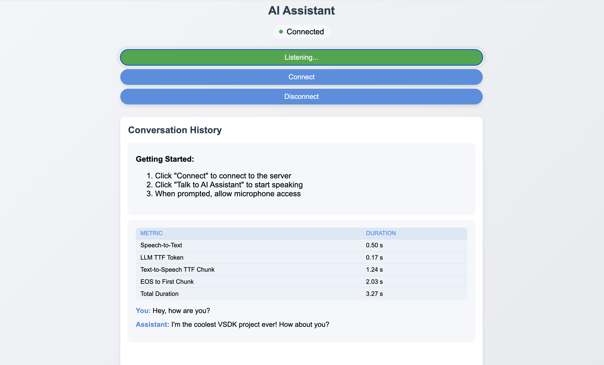

<p align="center">
  
</p>

<h1 align="center">vsdk</h1>

<p align="center">
  <strong>A fun, educational,hacky Voice SDK.</strong>
  <br />
  <em>Production <strong>not ready</strong>. For serious projects, consider <a href="https://github.com/pipecat-ai/pipecat">pipecat</a> or <a href="https://github.com/livekit/livekit">livekit</a>.</em>
</p>

<p align="center">

</p>

## Why this project even exists?
Together with my best friend we were curious how hard it would be to write it without external orchestrating libraries, so we hacked it in few days. We also wrote article about our voice-ai journey.

**Coolest Feature:** The agent can pause its speech when you interject with short phrases like "mhmm" and then seamlessly resume.

You might find leaking buffers. It's hacky, but it works, and that's pretty cool.

Authors [@bnowako](https://github.com/bnowako), [@moscicky](https://github.com/moscicky)

## Getting Started

### Prerequisites

* Python
* uv
* API keys for OpenAI, Groq, and ElevenLabs

### Installation

1. Install packages:
   ```sh
   make install
   ```
2. Set up environment variables:
    * Create a `.env` file in the `backend` directory.
    * Use `backend/.env.example` as a template.
3. Run the application:
   ```sh
   make run
   ```
4. Open [http://localhost:8000/vsdk](http://localhost:8000/vsdk) in your browser and start talking to the agent.

## Features

* **Twilio Integration:** A Twilio-compatible WebSocket interface is available at `http://localhost:8000/twilio`.
* **Customizable Interfaces:** You can implement your own `Agent` with custom logic or integrate STT/TTS services from different providers.

   ```python
   class VoiceAgent:
       def __init__(
           self,
           stt: BaseSTT,
           tts: BaseTTS,
           agent: BaseAgent,
       ) -> None:
           self.stt = stt
           self.tts = tts
           self.agent = agent
   ```

## Contact

Błażej Nowakowski - [@bnowako](https://x.com/bnowako)

